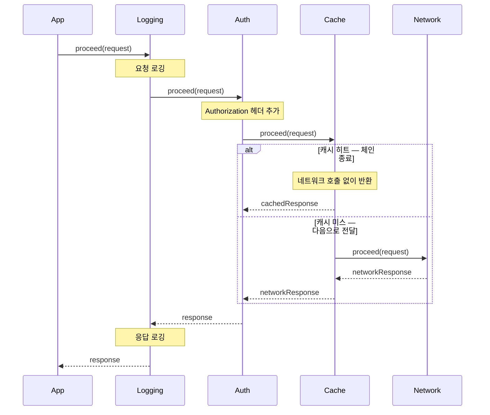

## 요청 하나에 처리 단계가 쌓일 때

네트워크 요청 하나를 보내려는데, 그 앞뒤로 해야 할 일이 자꾸 늘어나는 경험은 흔합니다. 요청을 보내기 전에 인증 헤더를 붙여야 하고, 같은 요청이라면 캐시를 먼저 확인하고 싶고, 디버깅을 위해 요청과 응답을 로깅하고 싶습니다.

이 일들을 한 클래스에 전부 몰아넣으면 책임이 비대해집니다. 그렇다고 `if-else`로 단계를 나열하면, 단계를 추가하거나 순서를 바꿀 때마다 그 분기를 다시 손봐야 해서 경직됩니다.

더 까다로운 건 따로 있습니다. **중간에 흐름을 끊어야 하는 경우**입니다. 예를 들어 캐시에 데이터가 있으면 그 자리에서 응답을 돌려주고 네트워크 호출은 아예 건너뛰고 싶습니다. 단순히 단계를 순서대로 실행하는 구조로는 "여기서 멈추고 결과를 반환한다"를 자연스럽게 표현하기 어렵습니다.

Chain of Responsibility(이하 CoR)는 이런 상황을 다루기 위한 패턴입니다.

## 처리할 수 있으면 처리하고, 아니면 넘긴다

CoR의 발상은 단순합니다. 요청을 처리할 수 있는 처리자(handler)들을 한 줄로 연결해 두고, 각 처리자는 요청을 직접 처리하거나 처리하지 못하면 다음 처리자에게 넘깁니다. 요청은 누군가 처리할 때까지(혹은 체인 끝까지) 흘러갑니다.

회사 결재 라인을 떠올리면 감이 옵니다. 10만 원짜리 구매 요청은 팀장 선에서 승인하고 끝납니다. 금액이 커지면 부장으로, 더 커지면 임원으로 넘어갑니다. 각 단계는 자기 권한 안의 요청은 처리하고, 넘는 것은 다음 단계로 전달합니다.

비유는 결재였지만, 같은 구조는 코드 곳곳에서 모습을 바꿔 등장합니다. 예를 들어 사용자에게 알림을 하나 보낸다고 해보죠. 푸시를 받을 수 있으면 푸시로, 안 되면 SMS로, 그것도 없으면 이메일로 보냅니다. 닿는 첫 번째 채널이 처리하고, 거기서 멈춥니다.

```kotlin
data class User(
    val pushToken: String?,
    val phoneNumber: String?,
    val email: String?,
)

abstract class Notifier(private val next: Notifier? = null) {

    fun send(user: User, message: String): String =
        tryDeliver(user, message)
            ?: next?.send(user, message)
            ?: "보낼 수 있는 채널이 없습니다"

    // 이 채널로 보낼 수 있으면 전송 결과를, 아니면 null 을 돌려준다
    protected abstract fun tryDeliver(user: User, message: String): String?
}

class PushNotifier(next: Notifier? = null) : Notifier(next) {
    override fun tryDeliver(user: User, message: String): String? =
        user.pushToken?.let { "푸시 전송: $message" }
}

class SmsNotifier(next: Notifier? = null) : Notifier(next) {
    override fun tryDeliver(user: User, message: String): String? =
        user.phoneNumber?.let { "SMS 전송: $message" }
}

class EmailNotifier(next: Notifier? = null) : Notifier(next) {
    override fun tryDeliver(user: User, message: String): String? =
        user.email?.let { "이메일 전송: $message" }
}
```

각 처리자는 `next` 참조만 알고 있을 뿐, 체인 전체의 모양은 모릅니다. 그래서 처리자를 추가하거나 순서를 바꾸는 일이 체인을 구성하는 쪽의 몫으로 분리됩니다.

```kotlin
val notifier = PushNotifier(
    next = SmsNotifier(
        next = EmailNotifier(),
    ),
)

val user = User(pushToken = null, phoneNumber = "010-1234-5678", email = "user@example.com")

notifier.send(user, "결제가 완료되었습니다")
// 푸시 토큰이 없어 SMS 가 처리 -> "SMS 전송: 결제가 완료되었습니다"
// 그 뒤의 EmailNotifier 까지는 내려가지 않는다
```

예시는 여기까지입니다. 이 구조가 실제 안드로이드 개발에서 어떻게 쓰이는지가 더 중요합니다.

## 이미 쓰고 있던 패턴, OkHttp Interceptor

안드로이드에서 네트워크를 다뤄봤다면 OkHttp의 Interceptor를 한 번쯤 작성해 봤을 겁니다. 그리고 그게 바로 CoR입니다.

OkHttp는 여러 Interceptor를 체인으로 연결하고, 각 인터셉터는 `chain.proceed(request)`를 호출해 다음 인터셉터에게 처리를 위임합니다. 요청은 체인을 따라 안쪽으로 흘러 들어가고, 응답은 그 역순으로 되돌아 나옵니다.

```kotlin
class LoggingInterceptor : Interceptor {
    override fun intercept(chain: Interceptor.Chain): Response {
        val request = chain.request()
        // 요청 로깅
        val response = chain.proceed(request) // 다음 인터셉터로 위임
        // 응답 로깅
        return response
    }
}
```

여기까지만 보면 단순히 "다음으로 넘기는" 구조라 Decorator와 비슷해 보입니다. CoR다운 면이 드러나는 지점은 따로 있습니다. 어떤 인터셉터는 `chain.proceed()`를 호출하지 않고 그 자리에서 응답을 만들어 반환할 수 있습니다. 캐시 처리가 대표적입니다. 캐시에 쓸 수 있는 응답이 있으면 네트워크로 내려가지 않고 곧장 응답을 돌려줍니다. **체인이 중간에 끊기는 것**입니다.



직접 만든다면 대략 이런 형태가 됩니다.

```kotlin
class CachingInterceptor(private val cache: ResponseCache) : Interceptor {
    override fun intercept(chain: Interceptor.Chain): Response {
        val request = chain.request()
        cache.get(request)?.let { return it } // 캐시 히트 -> 여기서 체인 종료
        val response = chain.proceed(request)  // 캐시 미스 -> 다음으로 위임
        cache.put(request, response)
        return response
    }
}
```

`chain.proceed()`를 부를지 말지를 각 인터셉터가 스스로 정하고, 부르지 않으면 그 뒤의 인터셉터들은 실행되지 않습니다. OkHttp Interceptor가 CoR의 사례로 자주 소개되는 건 바로 이 지점, "처리할지 위임할지를 처리자가 결정하고 필요하면 체인을 끊는다"는 성격 때문입니다.

다만 분류를 너무 단정하지는 않는 편이 정확합니다. 정상 흐름에서는 모든 인터셉터가 다 실행되며 각자 기능을 덧붙인다는 점(로깅, 인증 헤더 추가 등)에서 Decorator나 pipeline에 가깝다고 보는 시각도 있습니다. 실제로 어느 한 분류로 딱 떨어진다기보다, "체인을 끊을 수 있다"는 CoR적 성격과 "기능을 덧붙이며 통과한다"는 Decorator적 성격을 함께 가진다고 이해하는 편이 OkHttp Interceptor의 동작에 더 가깝습니다.

위 예제는 핵심 아이디어를 보여주기 위해 단순화한 것입니다. 실제 OkHttp의 `CacheInterceptor`는 조건부 요청(`If-None-Match` 등)이나 304 응답 처리까지 포함해 더 정교하게 동작합니다. 또 OkHttp에는 사용자가 등록하는 application interceptor와 네트워크 계층에 가까운 network interceptor가 있는데, 둘은 체인에서 놓이는 위치와 보게 되는 요청·응답이 대체로 다릅니다. 이 구분은 캐시나 리다이렉트가 끼면 동작이 달라질 수 있어, 직접 인터셉터를 작성할 때 한 번 확인해 두면 도움이 됩니다.

## 터치 이벤트도 같은 결로 흐른다

조금 다른 사례로 안드로이드 View의 터치 이벤트 전파도 CoR의 성격을 가집니다. 이벤트가 위에서 아래로 내려가고, 처리한 곳에서 멈춘다는 점이 닮았습니다.

```
MotionEvent 발생
→ Activity.dispatchTouchEvent()
    → ViewGroup.dispatchTouchEvent()   ← 자식에게 전달 시도
        → View.dispatchTouchEvent()
            → View.onTouchEvent()       ← true 반환 시 여기서 전파 종료
```

`onTouchEvent()`가 `true`를 반환해 이벤트를 소비하면 전파가 멈춥니다. 처리한 처리자가 흐름을 끊는다는 점에서 인터셉터 체인과 같은 모양입니다. 위 흐름은 이해를 돕기 위해 단순화한 것이고, 실제로는 `ViewGroup`이 `onInterceptTouchEvent()`로 자식에게 가기 전에 이벤트를 가로채는 등 더 세밀한 규칙이 있습니다.

## 헷갈리기 쉬운 지점, Decorator와의 차이

CoR을 처음 보면 Decorator와 자주 헷갈립니다. 둘 다 객체를 체인처럼 연결하고, 요청이 그 사이를 통과하기 때문입니다. 차이는 우열이 아니라 목적에 있습니다.

| 항목 | Chain of Responsibility | Decorator |
|------|------------------------|-----------|
| 핵심 목적 | 누가 처리할지 결정, 중간에 끊을 수 있음 | 기능을 덧붙이며 다음으로 위임 |
| 체인 중단 | 가능 (처리되면 멈춤) | 일반적으로 항상 위임 |
| 안드로이드 예 | OkHttp Interceptor, View 터치 이벤트 | `InputStream` 계열, `ContextWrapper` |

Decorator는 통과하는 모든 단계에서 기능을 더하는 데 초점이 있어, 보통 흐름을 끊지 않고 끝까지 위임합니다. CoR은 "이 요청을 누가 책임질 것인가"가 관심사라, 책임질 처리자가 나오면 거기서 멈춥니다. 같은 체인 구조여도 풀려는 문제가 다른 셈입니다.

## 정리하며

CoR은 처리자들을 한 줄로 잇고, 각자 처리하거나 다음으로 넘기는 단순한 구조입니다. 핵심은 **체인을 중간에 끊을 수 있다**는 점이고, 이것이 항상 위임하는 Decorator와 갈리는 지점입니다.

그리고 이 패턴은 멀리 있지 않습니다. OkHttp Interceptor를 작성해 봤다면, 이미 CoR의 사례로 흔히 소개되는 코드를 써 본 셈입니다. 평소 무심코 쓰던 라이브러리의 동작을 한 겹 들춰 보면, 그 안에 이런 설계가 녹아 있는 경우가 많습니다.

## Learn More

본문에서 다룬 내용에서 한 발 더 들어가고 싶다면, 다음 주제들을 직접 살펴보시길 권합니다.

1. **OkHttp 체인의 실제 구현:**

    OkHttp는 `RealInterceptorChain`이 `index`를 하나씩 늘려가며 다음 인터셉터를 호출하는 방식으로 체인을 구현합니다. <br>
    `chain.proceed()`가 어떻게 다음 단계로 이어지는지 소스를 직접 따라가 보세요.

2. **application interceptor vs network interceptor:**

    `addInterceptor`와 `addNetworkInterceptor`로 등록한 인터셉터는 체인에서의 위치가 다릅니다. <br>
    캐시 히트나 리다이렉트가 일어날 때 각각이 몇 번 호출되는지, 보는 요청·응답이 어떻게 다른지 비교해 보세요.

3. **직접 인터셉터 작성해 보기:**

    토큰 만료 시 자동으로 갱신하는 인터셉터를 직접 만들어 보세요. <br>
    어느 시점에 `chain.proceed()`를 다시 호출해야 하는지, 그리고 무한 재시도를 어떻게 막을지 고민해 보면 체인 제어 감각이 잡힙니다. 그 후에는 OkHttp가 같은 목적으로 제공하는 `Authenticator`로도 구현해 보시길 권합니다.

4. **View 이벤트 가로채기:**

    `ViewGroup.onInterceptTouchEvent()`를 활용하면 부모가 자식에게 가기 전에 이벤트를 가로챌 수 있습니다. <br>
    스크롤 컨테이너 안의 버튼처럼 부모와 자식이 같은 제스처를 두고 경쟁하는 상황에서 이 메커니즘이 어떻게 쓰이는지 찾아보세요.
